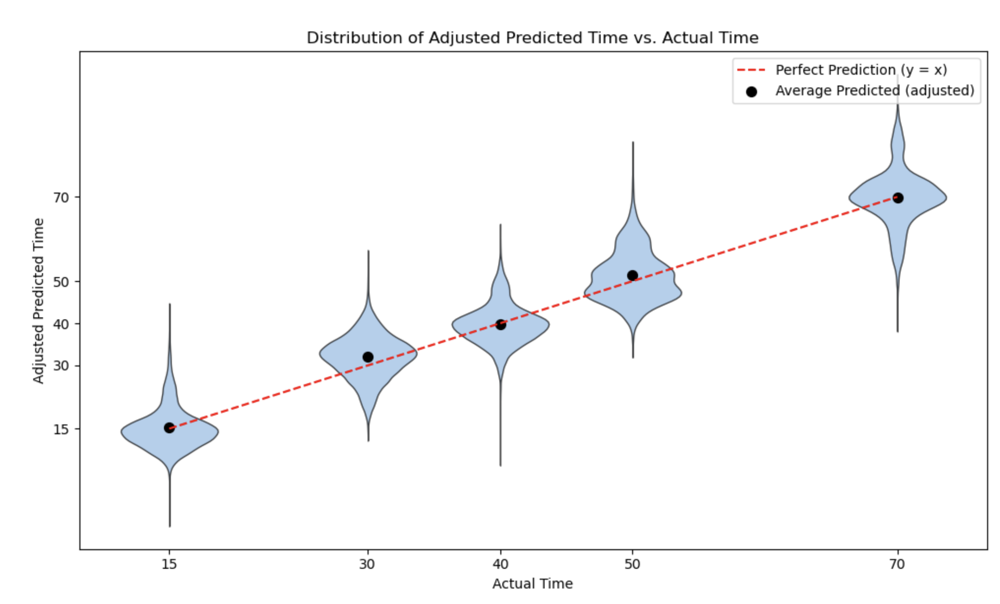

# ChronoMate

ChronoMate is a Python package that uses **Domain-Adversarial Neural Networks (DANN)** to predict developmental time points from single-cell RNA-seq data while correcting cross-dataset batch effects.

---

## Example

ChronoMate aligns predicted and actual developmental time with high accuracy.

**Train Data**: Drosophila visual system snRNA-seq data, with time points from 0 to 96h in 12h increments ([Kurmangaliev et al., 2020](https://www.cell.com/neuron/fulltext/S0896-6273(20)30774-1?dgcid=raven_jbs_aip_email))  
**Test Data**: Drosophila visual system snRNA-seq data, with time points 15h, 30h, 40h, 50h and 70h ([Özel et al., 2021](https://www.nature.com/articles/s41586-020-2879-3))

---
## Installation

### 1. Create a virtual environment
<pre><code>
# Windows (PowerShell)
python -m venv .venv

# macOS/Linux
python3 -m venv .venv
</code></pre>

### 2. Activate the virtual environment
<pre><code>
# Windows (PowerShell)
.\.venv\Scripts\Activate

# macOS/Linux
source .venv/bin/activate
</code></pre>

### 3. Install dependencies
<pre><code>
pip install -r requirements.txt
</code></pre>

### 4. (Optional) Install the package itself
<pre><code>
pip install .
</code></pre>

### 5. Verify installation
<pre><code>
# Should print a help message with available commands
python -m chronomate.cli --help
</code></pre>

---

## Quick Start

Inputs can be `.h5ad` (AnnData) or `.csv`.

- For `.h5ad`, pass the obs keys (e.g., `dev_time_h`, `cell_type`).
- For `.csv`, columns may include `time` and `cell_type` (time can be absent for target/outside data).

Train DANN:

    python -m chronomate.cli train-dann --source data/source.h5ad --target data/target.h5ad --obs-time-key dev_time_h --obs-celltype-key cell_type --outdir runs/dann_experiment

Evaluate (writes metrics + parity plot if labels exist):

    python -m chronomate.cli eval --checkpoint runs/dann_experiment/best.pt --data data/target.h5ad --obs-time-key dev_time_h --obs-celltype-key cell_type --outdir runs/dann_experiment/eval_target

Predict only (no labels required):

    python -m chronomate.cli predict --checkpoint runs/dann_experiment/best.pt --data data/outside.h5ad --obs-celltype-key cell_type --out preds.csv

Baseline XGBoost:

    python -m chronomate.cli train-xgb --source data/source.h5ad --target data/target.h5ad --obs-time-key dev_time_h --obs-celltype-key cell_type --outdir runs/xgb_experiment

---

## What It Does

- Domain-adversarial training reduces batch effects.
- 10-dim cell-type embedding concatenated to scaled gene features.
- Metrics & plots: RMSE, MAE, R²; parity plots.
- Mixed precision by default (disable with `--no-amp`).
- XGBoost baseline for comparison.

---

## Layout

    chronomate/
    ├─ data.py        # I/O, scaling, dataset
    ├─ models.py      # DANN + Gradient Reversal + XGB wrapper
    ├─ train.py       # training loops, checkpointing
    ├─ evaluate.py    # metrics + plots + CSV export
    └─ cli.py         # CLI entrypoints

---

## Reference

- Kurmangaliyev, Yerbol Z., et al. "Transcriptional programs of circuit assembly in the Drosophila visual system." Neuron 108.6 (2020): 1045-1057.
- Özel, Mehmet Neset, et al. "Neuronal diversity and convergence in a visual system developmental atlas." Nature 589.7840 (2021): 88-95.
- Cui, Yingjun, Susanta K. Behura, and Alexander WE Franz. "Cellular diversity and gene expression profiles in the male and female brain of Aedes aegypti." BMC genomics 23.1 (2022): 119.

---

## License

MIT
