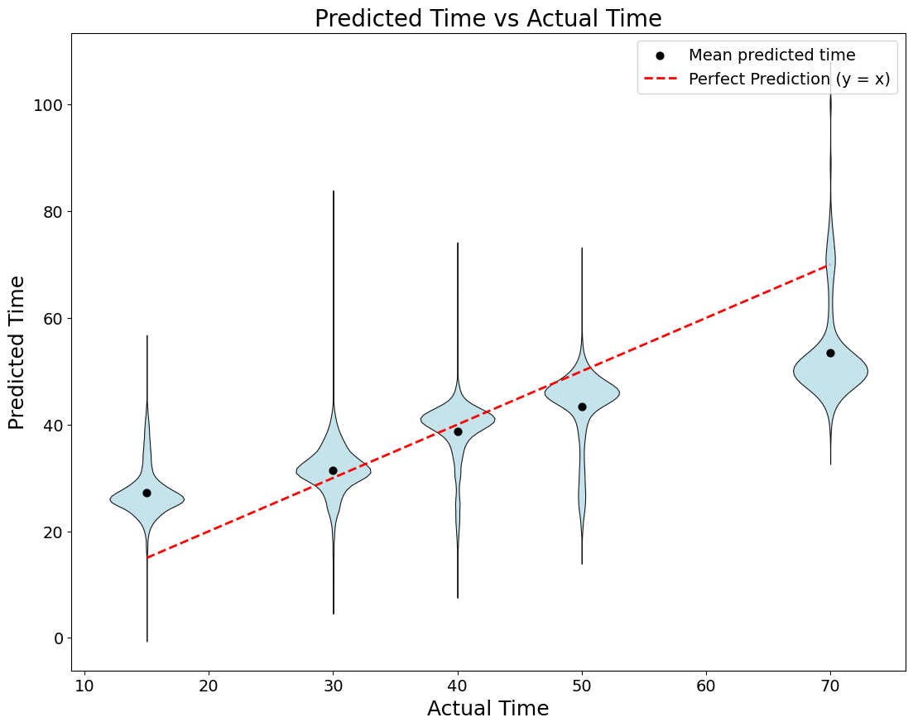

# ChronoMate

ChronoMate predicts **Drosophila developmental time** from **single-cell RNA-seq** and transfers that predictor across datasets/labs.

The current pipeline is:

1. **Prepare raw-count AnnData (`.h5ad`)** for TRAIN and TEST  
2. **Normalize / integrate with scVI** (train reference → map test)  
3. **Train a regressor (XGBoost) on scVI latent** to predict time (hours)  
4. **Evaluate + plot** (MAE, nearest-allowed-time accuracy, violin + mean + y=x)

> Note: Older parts of this repo may reference domain-adversarial training (DANN). The stable workflow is **scVI → XGBoost**.

---

## Data sources (GEO)

**TRAIN (source):** Kurmangaliyev et al., Neuron 2020  
- GEO: GSE156455  
- Link: https://www.ncbi.nlm.nih.gov/geo/query/acc.cgi?acc=GSE156455

**TEST (target):** Özel et al., Nature 2021  
- GEO: GSE142787  
- Link: https://www.ncbi.nlm.nih.gov/geo/query/acc.cgi?acc=GSE142787

---

## What “normalization” means here

This project uses **scVI (scvi-tools)** for normalization / batch-aware representation learning.

- **Input to scVI:** raw counts (nonnegative) in `adata.layers["counts"]`
- **Output used for prediction:** latent embeddings `Z` (cells × latent_dim)
- **Optional output:** model-based normalized expression (large; not required for XGBoost)

The regressor does **not** train directly on raw counts. It trains on **scVI latent**.

---

## Installation

### 1) Create a virtual environment

```bash
# Windows (PowerShell)
python -m venv .venv

# macOS/Linux
python3 -m venv .venv
```

### 2) Activate

```bash
# Windows (PowerShell)
.\.venv\Scripts\Activate

# macOS/Linux
source .venv/bin/activate
```

### 3) Install dependencies

```bash
pip install -r requirements.txt
```

### 4) (Optional) Install the package

```bash
pip install .
```

### 5) Verify

```bash
python -m chronomate.cli --help
```

---

## Inputs

ChronoMate expects **AnnData `.h5ad`** inputs for both TRAIN and TEST, with:

- `adata.layers["counts"]`: raw counts (sparse OK)
- `adata.obs["time"]`: time label  
  - TRAIN time can be `"48h"` or `48` (converted to numeric hours internally)  
  - TEST time is optional (required for evaluation/plots)

Recommended filenames (example):

- TRAIN: `GSE156455/processed_train_counts.h5ad`
- TEST:  `GSE142787/processed_test_counts.h5ad`

---

## Method overview (scVI → XGBoost)

### Step 1 — scVI reference + query mapping

Train scVI on TRAIN counts (reference), then map TEST into the same latent space (query).

Outputs:
- `scvi_model/`
- `train_latent.csv`
- `test_latent.csv`

### Step 2 — Train regressor and predict

Train XGBoost on TRAIN latent `Z_train → time_hours`, then predict on TEST latent `Z_test`.

Output:
- `predictions.csv` with:
  - `cell_id`
  - `predicted_time`
  - (optional) `time` if TEST labels exist

### Step 3 — Evaluate + plots

If TEST contains `obs["time"]`, the evaluation reports:
- MAE (hours)
- Nearest-allowed-time accuracy (snap each prediction to nearest test timepoint)

Plots saved to output directory:
- `scatter_mean.png`
- `boxplot_by_time.png`
- `Figure 3.png` (violin + mean + y=x)

---

## Quick start (CLI)

### 1) Run scVI normalization + latent export

```bash
python -m chronomate.cli scvi-normalize ^
  --train "C:\2024 Fall\chronocell\GSE156455\processed_train_counts.h5ad" ^
  --test  "C:\2024 Fall\chronocell\GSE142787\processed_test_counts.h5ad" ^
  --outdir "C:\2024 Fall\chronocell\runs\scvi_ref"
```

### 2) Train XGBoost on scVI latent + predict TEST

```bash
python -m chronomate.cli train-xgb-latent ^
  --train-latent "C:\2024 Fall\chronocell\runs\scvi_ref\train_latent.csv" ^
  --test-latent  "C:\2024 Fall\chronocell\runs\scvi_ref\test_latent.csv" ^
  --outdir "C:\2024 Fall\chronocell\runs\scvi_xgb"
```

### 3) Evaluate + generate plots

```bash
python -m chronomate.cli eval ^
  --predictions "C:\2024 Fall\chronocell\runs\scvi_xgb\predictions.csv" ^
  --outdir "C:\2024 Fall\chronocell\runs\scvi_xgb\eval"
```

---

## Figure



---

## Notes on the legacy CSV z-score workflow

If you see CSV matrices with many negatives and max values exactly `10`, those are likely **z-scored / clipped** features (e.g., `sc.pp.scale(..., max_value=10)`). Those are **not** valid scVI inputs. scVI requires raw counts.

---

## References

- Kurmangaliyev YZ et al. *Transcriptional Programs of Circuit Assembly in the Drosophila Visual System.* Neuron (2020). GEO: GSE156455  
- Özel MN et al. *Neuronal diversity and convergence in a visual system developmental atlas.* Nature (2021). GEO: GSE142787  

---

## License

MIT
