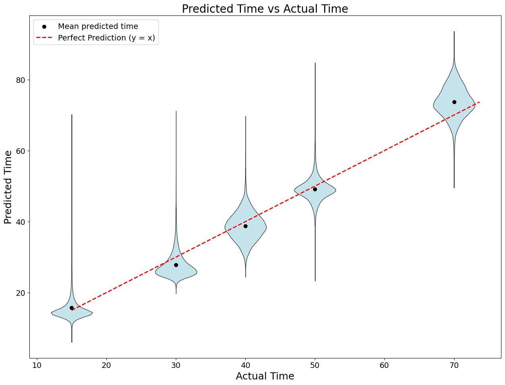

# ChronoMate

ChronoMate predicts **Drosophila developmental time (hours)** from **single-cell RNA-seq**
and transfers that predictor across datasets/labs using a simple, robust pipeline:

**Raw counts → scVI latent (batch-aware) → XGBoost regression → evaluation + plots**

> Current stable workflow: **scVI → XGBoost**  
> Older/legacy code paths (e.g., CSV z-score features, DANN) are not part of the recommended pipeline.

---

## What it does

Given a labeled **TRAIN** dataset and a (possibly unlabeled) **TEST** dataset:

1) Learn a batch-aware representation with **scVI (VAE)** on raw counts  
2) Map TEST into the same latent space (query mapping)  
3) Train **XGBoost** on TRAIN latent to predict time (hours)  
4) Predict + evaluate on TEST and generate plots  

---

## Data sources (GEO)

**TRAIN (source):** Kurmangaliyev et al., *Neuron* 2020  
- GEO: GSE156455  
- https://www.ncbi.nlm.nih.gov/geo/query/acc.cgi?acc=GSE156455

**TEST (target):** Özel et al., *Nature* 2021  
- GEO: GSE142787  
- https://www.ncbi.nlm.nih.gov/geo/query/acc.cgi?acc=GSE142787

---

## Key idea: what “normalization” means here

ChronoMate uses **scVI (scvi-tools)** to learn a **batch-aware latent embedding** from **raw counts**.

- Input: nonnegative raw counts in `adata.layers["counts"]`
- Features for regression: scVI latent `Z` (cells × latent_dim)
- Optional: model-based normalized expression (not required for XGBoost)

The regressor does **not** train on gene-level raw counts directly.  
It trains on the **scVI latent representation**.

---

## Installation

```bash
python -m venv .venv
source .venv/bin/activate  # or .venv\Scripts\Activate on Windows
pip install -r requirements.txt
```

Verify installation:

```bash
python -m chronomate.cli --help
```

---

## Quick start (CLI)

### 1) Export scVI latents

```bash
python -m chronomate.cli scvi-export-latent   --train-h5ad path/to/train_counts.h5ad   --test-h5ad  path/to/test_counts.h5ad   --model-dir  path/to/scvi_model   --out-train-csv train_latent.csv   --out-test-csv  test_latent.csv   --query-max-epochs 1
```

### 2) Train XGBoost + predict

```bash
python -m chronomate.cli train-xgb-latent   --train-latent train_latent.csv   --test-latent  test_latent.csv   --outdir runs/xgb_on_scvi_latent
```

### 3) Evaluate

```bash
python -m chronomate.cli eval   --predictions runs/xgb_on_scvi_latent/predictions.csv   --outdir runs/xgb_on_scvi_latent/eval
```

---

## Example results (scVI → XGBoost)

Example mean predicted time per true time (hours):

| True Time | Mean Predicted |
|----------:|---------------:|
| 15        | 15.80 |
| 30        | 27.82 |
| 40        | 38.77 |
| 50        | 49.12 |
| 70        | 73.68 |

Overall regression metrics (example):

- MAE: **1.75 hours**
- RMSE: **2.06 hours**
- R²: **0.988**
- Pearson r: **0.996**
- Within ±2h: **60%**
- Within ±5h: **100%**

> Note: The numbers above are an example summary computed on per-time means.
> For reporting performance, prefer metrics computed over **all cells**.

---

## Figure

Place the generated figure image in your repo (example path shown below) and keep this link as-is:



---

## Notes / troubleshooting

### scVI requires raw counts
If you see negative values or capped values (e.g., exactly 10), those are likely scaled/z-scored features (not counts).
scVI expects nonnegative count-like input.

### Query mapping
Depending on scvi-tools version, query models may require:

```python
q.train(max_epochs=1)
```

before calling `get_latent_representation()`.

---

## License

MIT
