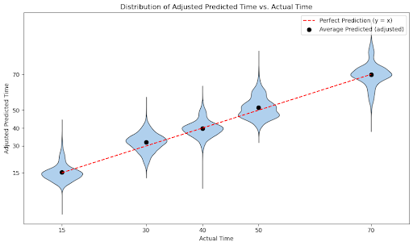

# ChronoMate

ChronoMate is a Python package that uses **Domain-Adversarial Neural Networks (DANN)** to predict developmental time points from single-cell RNA-seq data while correcting cross-dataset batch effects.

---

## Installation

(Use either requirements or your own environment. Example with a virtual env:)

    python -m venv .venv
    # Windows PowerShell:
    .venv\Scripts\Activate
    # macOS/Linux:
    # source .venv/bin/activate
    pip install -r requirements.txt
    # or if installing the package itself:
    # pip install .

---

## Example Result

ChronoMate aligns predicted and actual developmental time with high accuracy:

(Place Figure3.png in the repo root next to README.md. If you keep it under assets/, change the path to assets/Figure3.png.)

---

## Quick Usage

Inputs can be `.h5ad` (AnnData) or `.csv`.

- For `.h5ad`, pass the obs keys (e.g., `dev_time_h`, `cell_type`).
- For `.csv`, columns may include `time` and `cell_type` (time can be absent for target/outside data).

Train DANN:

    python -m chronomate.cli train-dann --source data/source.h5ad --target data/target.h5ad --obs-time-key dev_time_h --obs-celltype-key cell_type --outdir runs/dann_experiment

Evaluate (writes metrics + parity plot if labels exist):

    python -m chronomate.cli eval --checkpoint runs/dann_experiment/best.pt --data data/target.h5ad --obs-time-key dev_time_h --obs-celltype-key cell_type --outdir runs/dann_experiment/eval_target

Predict only (no labels required):

    python -m chronomate.cli predict --checkpoint runs/dann_experiment/best.pt --data data/outside.h5ad --obs-celltype-key cell_type --out preds.csv

Baseline XGBoost:

    python -m chronomate.cli train-xgb --source data/source.h5ad --target data/target.h5ad --obs-time-key dev_time_h --obs-celltype-key cell_type --outdir runs/xgb_experiment

---

## What It Does (brief)

- Domain-adversarial training reduces batch effects.
- 10-dim cell-type embedding concatenated to scaled gene features.
- Metrics & plots: RMSE, MAE, R²; parity plots.
- Mixed precision by default (disable with `--no-amp`).
- XGBoost baseline for comparison.

---

## Layout

    chronomate/
    ├─ data.py        # I/O, scaling, dataset
    ├─ models.py      # DANN + Gradient Reversal + XGB wrapper
    ├─ train.py       # training loops, checkpointing
    ├─ evaluate.py    # metrics + plots + CSV export
    └─ cli.py         # CLI entrypoints

---

## Datasets to Cite

- Kurmangaliyev, Yerbol Z., et al. "Transcriptional programs of circuit assembly in the Drosophila visual system." Neuron 108.6 (2020): 1045-1057.
- Lago-Baldaia, Inês, et al. "A Drosophila glial cell atlas reveals a mismatch between transcriptional and morphological diversity." PLoS biology 21.10 (2023): e3002328.
- Cui, Yingjun, Susanta K. Behura, and Alexander WE Franz. "Cellular diversity and gene expression profiles in the male and female brain of Aedes aegypti." BMC genomics 23.1 (2022): 119.

---

## License

MIT
