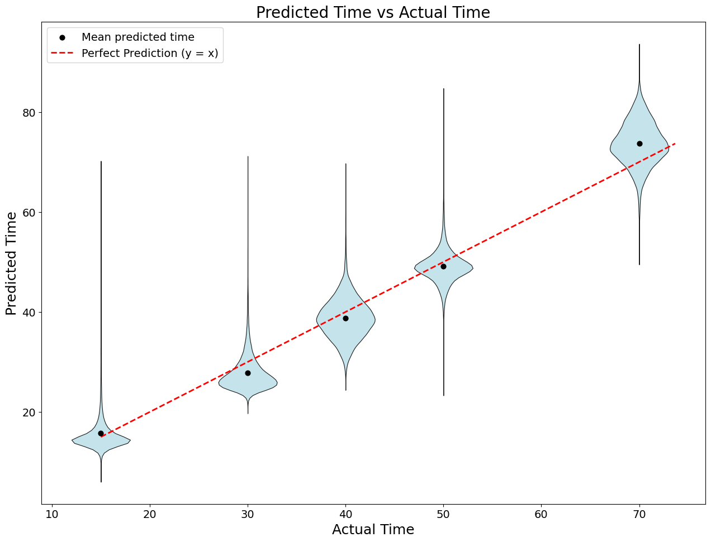

# ChronoMate

ChronoMate predicts ***Drosophila* developmental state (hours)** from a labeled **scRNA-seq** dataset
and transfers that predictor across unlabeled datasets and samples from different experiments. 

**Pipeline: Raw counts → scVI latent → XGBoost regression → evaluation + plots**


---

## What it does

Given a labeled **TRAIN** dataset and a unlabeled **TEST** dataset for developmental state marked in hours, ChronocMate determines the **TEST** sample developmetal state with accuracy.  

## Steps
1) Learn a batch-corrected representation with **scVI (VAE)** on raw counts  
2) Map TEST into the same latent space  
3) Train **XGBoost** on TRAIN latent to predict time (hours)  
4) Predict + evaluate on TEST and generate plots  

---

## Data sources (GEO)

**TRAIN (source):** Kurmangaliyev et al., *Neuron* 2020  
- This is a time-series *Drosophila* single-cell dataset with samples from pupa (P0) to adult (P96) in 12h increments
- GEO: GSE156455  
- https://www.ncbi.nlm.nih.gov/geo/query/acc.cgi?acc=GSE156455

**TEST (target):** Özel et al., *Nature* 2021  
- similar to train data with time points P15, P30, P40, P50, P70. 
- GEO: GSE142787  
- https://www.ncbi.nlm.nih.gov/geo/query/acc.cgi?acc=GSE142787

---

## Batch-correction

ChronoMate uses **scVI (scvi-tools)** to learn a **batch-aware latent embedding** from **raw counts**.

- Input: nonnegative raw counts in `adata.layers["counts"]`
- Features for regression: scVI latent `Z` (cells × latent_dim)

The regressor does **not** train on gene-level raw counts directly.  
It trains on the **scVI latent representation**.

---

## Installation

```bash
python -m venv .venv
source .venv/bin/activate  # or .venv\Scripts\Activate on Windows
pip install -r requirements.txt
```

Verify installation:

```bash
python -m chronomate.cli --help
```

---

## Quick start (CLI)

### 1) Export scVI latents

```bash
python -m chronomate.cli scvi-export-latent   --train-h5ad path/to/train_counts.h5ad   --test-h5ad  path/to/test_counts.h5ad   --model-dir  path/to/scvi_model   --out-train-csv train_latent.csv   --out-test-csv  test_latent.csv   --query-max-epochs 1
```

### 2) Train XGBoost + predict

```bash
python -m chronomate.cli train-xgb-latent   --train-latent train_latent.csv   --test-latent  test_latent.csv   --outdir runs/xgb_on_scvi_latent
```

### 3) Evaluate

```bash
python -m chronomate.cli eval   --predictions runs/xgb_on_scvi_latent/predictions.csv   --outdir runs/xgb_on_scvi_latent/eval
```

---

## Example results (scVI → XGBoost)

Example mean predicted time per true time (hours):

| True Time | Mean Predicted |
|----------:|---------------:|
| 15        | 15.80 |
| 30        | 27.82 |
| 40        | 38.77 |
| 50        | 49.12 |
| 70        | 73.68 |

Overall regression metrics (sample-level):

- MAE: **1.75 hours**
- RMSE: **2.06 hours**
- R²: **0.988**
- Pearson r: **0.996**
- Within ±2h: **60%**
- Within ±5h: **100%**

> For reporting performance, metrics can be computed over **all cells**.


Figure 1: example of prediction performance using Chronocell

---

## Notes 

### On organisms outside of *Drosophila*
This tool is only guaranteed to work with *Drosophila* neuron data, performance may drop for higher organisms like mouse or human due to higher variation between individuals in transcription profiles. 

### scVI requires raw counts
If you see negative values or floats, those are likely scaled/z-scored features and not counts.
scVI expects nonnegative count-like input. Refer to the Seurat/Scanpy object and find the ['counts'] layer to proceed. 
### Query mapping
Depending on scvi-tools version, query models may require:

```python
q.train(max_epochs=1)
```

before calling `get_latent_representation()`.

---

## License

MIT
