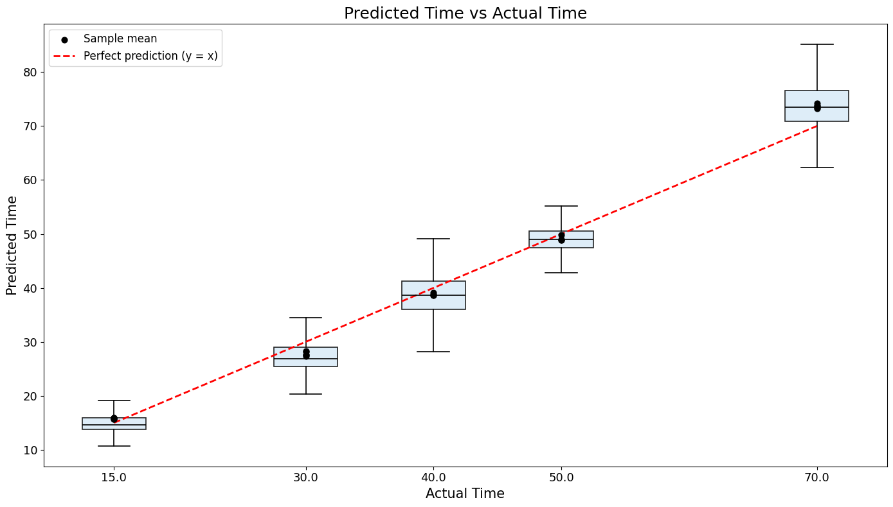

# ChronoMate

ChronoMate predicts developmental time from single-cell RNA-seq using a two-step workflow:

1. **scVI** learns a latent embedding from **raw counts**
2. **XGBoost** predicts developmental time from the scVI latent space

---

## Example results

  
Figure 1: Sample-level prediction performance

| Sample | True Time (h) | Predicted (h) | Error (h) | Abs Error (h) | # Cells |
|--------|---------------|---------------|-----------|---------------|--------:|
| P15_1  | 15 | 15.92 | +0.92 | 0.92 | 6959 |
| P15_2  | 15 | 15.82 | +0.82 | 0.82 | 6905 |
| P15_3  | 15 | 15.91 | +0.91 | 0.91 | 6708 |
| P15_5  | 15 | 15.63 | +0.63 | 0.63 | 5087 |
| P15_6  | 15 | 15.63 | +0.63 | 0.63 | 5359 |
| P30_1  | 30 | 27.31 | -2.69 | 2.69 | 6717 |
| P30_2  | 30 | 27.63 | -2.37 | 2.37 | 6595 |
| P30_3  | 30 | 27.61 | -2.39 | 2.39 | 6638 |
| P30_4  | 30 | 28.14 | -1.86 | 1.86 | 7846 |
| P30_5  | 30 | 28.28 | -1.72 | 1.72 | 7692 |
| P40_1  | 40 | 38.59 | -1.41 | 1.41 | 6138 |
| P40_2  | 40 | 38.63 | -1.37 | 1.37 | 6221 |
| P40_3  | 40 | 38.77 | -1.23 | 1.23 | 6188 |
| P40_4  | 40 | 39.17 | -0.83 | 0.83 | 5164 |
| P50_1  | 50 | 49.77 | -0.23 | 0.23 | 6334 |
| P50_2  | 50 | 49.01 | -0.99 | 0.99 | 7895 |
| P50_3  | 50 | 48.91 | -1.09 | 1.09 | 8342 |
| P50_4  | 50 | 48.93 | -1.07 | 1.07 | 8012 |
| P70_5  | 70 | 74.20 | +4.20 | 4.20 | 10547 |
| P70_6  | 70 | 73.72 | +3.72 | 3.72 | 8774 |
| P70_7  | 70 | 73.68 | +3.68 | 3.68 | 8891 |
| P70_8  | 70 | 73.25 | +3.25 | 3.25 | 8166 |
| P70_9  | 70 | 73.36 | +3.36 | 3.36 | 7101 |

### Overall performance

**Sample-level**
- MAE: **1.80 hours**
- RMSE: **2.13 hours**
- R²: **0.988**
- n = **23 samples**

**Cell-level**
- MAE: **3.38 hours**
- RMSE: **4.66 hours**
- R²: **0.944**
- n = **164,279 cells**

  
Figure 2: Overall prediction distribution

---

## Data sources

**TRAIN:** Kurmangaliyev et al., *Neuron* 2020  
- Time-series *Drosophila* single-cell dataset from pupa (P0) to adult (P96) in 12 h increments
- GEO: GSE156455  
- https://www.ncbi.nlm.nih.gov/geo/query/acc.cgi?acc=GSE156455

**TEST:** Özel et al., *Nature* 2021  
- *Drosophila* single-cell dataset with time points P15, P30, P40, P50, P70
- GEO: GSE142787  
- https://www.ncbi.nlm.nih.gov/geo/query/acc.cgi?acc=GSE142787

---

## Installation

```bash
python -m venv .venv
source .venv/bin/activate  # or .venv\Scripts\activate on Windows
pip install -r requirements.txt
```

Verify installation:

```bash
python -m chronomate.cli --help
```

---

## Quick start

### 1) Prepare input data

You need:

- `train_counts.h5ad`
- `test_counts.h5ad`

Expected structure:
- cells in rows
- genes in columns
- raw nonnegative counts in `adata.layers["counts"]`

Expected `adata.obs` columns:
- `cell_id` — used to track cells across latent export, prediction, and evaluation
- `time` — required for regression target and evaluation
- `rep` — required if using batch-aware scVI with `batch_key="rep"`
- `type` — optional

If `rep` is not available, scVI can still run without explicit batch correction.

### 2) Export scVI latent embeddings

```bash
python -m chronomate.cli scvi-export-latent \
  --train-h5ad path/to/train_counts.h5ad \
  --test-h5ad path/to/test_counts.h5ad \
  --model-dir path/to/scvi_model \
  --out-train-csv train_latent.csv \
  --out-test-csv test_latent.csv \
  --query-max-epochs 1
```

### 3) Train XGBoost and predict time

```bash
python -m chronomate.cli train-xgb-latent \
  --train-latent train_latent.csv \
  --test-latent test_latent.csv \
  --outdir runs/xgb_on_scvi_latent
```

### 4) Evaluate predictions

```bash
python -m chronomate.cli eval \
  --predictions runs/xgb_on_scvi_latent/predictions.csv \
  --outdir runs/xgb_on_scvi_latent/eval
```

---

## Notes

scVI uses raw counts from `adata.layers["counts"]`. If your matrix contains negative values, scaled values, log-normalized values, or z-scored values, it is not valid scVI input.

ChronoMate uses the scVI latent embedding for regression. XGBoost trains on `z1 ... zN`, not directly on gene-level counts.

If a batch column such as `rep` is provided, scVI can run batch-aware integration with `batch_key="rep"`. If not, it can still run without explicit batch correction.

Depending on `scvi-tools` version, query mapping may require `q.train(max_epochs=1)` before `q.get_latent_representation()`.

ChronoMate is currently intended for *Drosophila* neuron data. Performance may drop on higher-variation datasets such as mouse or human.

---

## License

MIT License
